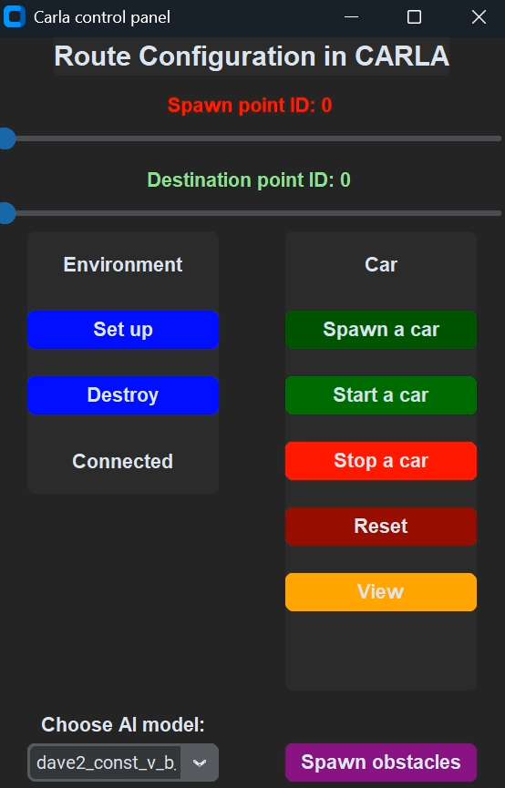
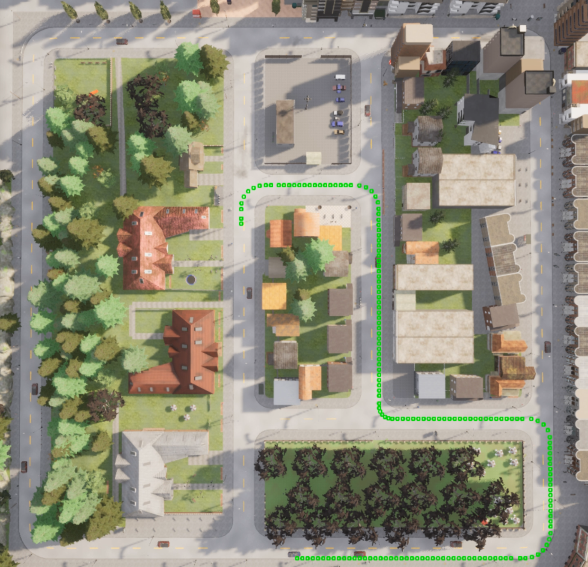
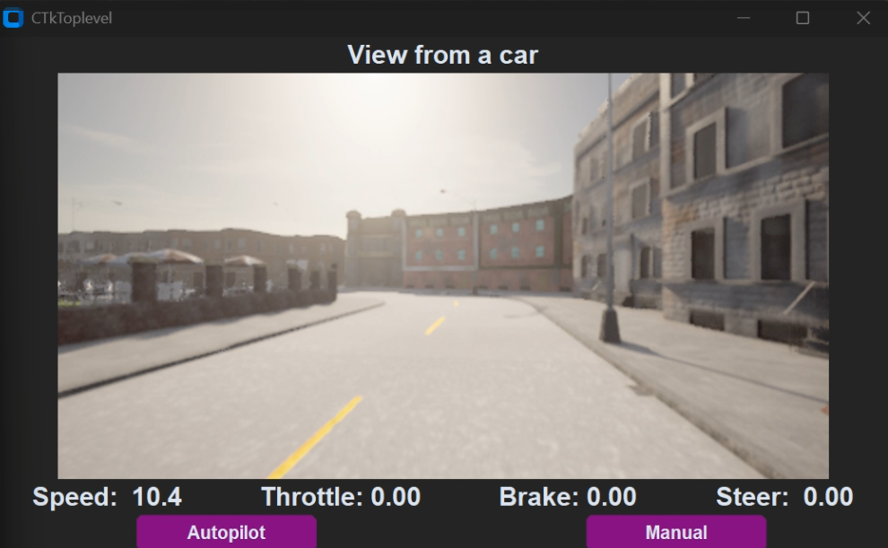

# CARLA Autonomous Vehicle

<div align="center">


**End-to-end deep learning approach for autonomous vehicle steering using the CARLA simulator**

</div>

---

## Overview

This project implements an autonomous driving system using deep learning techniques in the CARLA simulator. The system learns to drive by imitating human driving behavior through end-to-end learning, where raw camera images are directly mapped to steering commands. 

The project explores multiple neural network architectures, culminating in a **Conditional Imitation Learning (CIL)** approach based on the NVIDIA DAVE-2 architecture, which successfully handles complex driving scenarios including intersections. 

### Project Journey

The development followed an iterative approach, experimenting with different models: 

1. **Depth Camera Model** - Initial attempt using depth camera input; limited success
2. **DAVE-2 (Steering Only)** - NVIDIA's end-to-end learning architecture with constant velocity; struggled at intersections
3. **DAVE-2 + CIL** ✅ - Final solution combining DAVE-2 with Conditional Imitation Learning, successfully handling intersections and lane following

---

## Features

- 🎮 **Interactive GUI** - User-friendly interface built with CustomTkinter
- 🚙 **Multiple Spawn Points** - Choose where to spawn the vehicle on the map
- 🎯 **Destination Selection** - Set custom navigation goals
- 🚧 **Dynamic Obstacles** - Toggle obstacles for testing
- 📹 **Real-time Camera Feed** - Live view from the vehicle's perspective
- 🧠 **Pre-trained Models** - Two ready-to-use trained models included
- 📊 **Data Collection Pipeline** - Tools for gathering and balancing training data

---

## Architecture

### Project Structure

```
carla-autonomous-vehicle/
├── src/
│   ├── data/                               # Data collection & preprocessing
│   │   ├── collect_data_*.py              # Data collection scripts for CARLA
│   │   ├── data_balance_*.py               # Dataset balancing utilities
│   │   └── data_fine_tune_*.py             # Fine-tuning data preparation
│   │
│   ├── models/                             # Neural network architectures
│   │   ├── model_dave2.py                  # Base DAVE-2 implementation
│   │   ├── model_dave2_const_v_b.py        # DAVE-2 with constant velocity
│   │   ├── model_dave2_const_v_b_CIL.py    # DAVE-2 + Conditional Imitation Learning
│   │   ├── model_depth_camera.py           # Depth camera based model
│   │   └── fine_tuning_*.py               # Fine-tuning scripts
│   │
│   ├── driving/                            # Model deployment to CARLA
│   │   └── load_model_*_to_carla.py        # Scripts for running trained models
│   │
│   └── ui/                                 # Graphical User Interface
│       └── gui.py                          # Main GUI application
│
├── experiments/                            # Experimental scripts and prototypes
├── pyproject.toml                          # Project dependencies
└── README.md
```

### Neural Network:  DAVE-2 + Conditional Imitation Learning

The final model architecture combines NVIDIA's DAVE-2 with Conditional Imitation Learning:

```
                    ┌─────────────────┐
                    │  Camera Input   │
                    │   (200x66x3)    │
                    └────────┬────────┘
                             │
                    ┌────────▼────────┐
                    │ Convolutional   │
                    │    Layers       │
                    │  (Feature       │
                    │  Extraction)    │
                    └────────┬────────┘
                             │
           ┌─────────────────┼─────────────────┐
           │                 │                 │
    ┌──────▼──────┐   ┌──────▼──────┐   ┌──────▼──────┐
    │   Module 1  │   │   Module 2  │   │   Module 3  │   ... 
    │   LEFT      │   │    RIGHT    │   │   STRAIGHT  │
    │(intersection│   │(intersection│   │(intersection│
    └──────┬──────┘   └──────┬──────┘   └──────┬──────┘
           │                 │                 │
           └─────────────────┼─────────────────┘
                             │
                    ┌────────▼────────┐
                    │ Command-based   │
                    │   Selection     │
                    └────────┬────────┘
                             │
                    ┌────────▼────────┐
                    │ Steering Angle  │
                    └─────────────────┘
```

**Key Innovation:** The fully connected layer is split into 4 specialized modules, each responsible for a different navigation command:
- **Module 1:** Turn left at intersection
- **Module 2:** Turn right at intersection
- **Module 3:** Go straight through intersection
- **Module 4:** Follow lane

---

## 🖼 Screenshots

<div align="center">

|             GUI Interface              |                City view                |
|:--------------------------------------:|:---------------------------------------:|
|  |  |

|                 Data Collection                 |
|:-----------------------------------------------:|
|  |

</div>

## Installation

### Prerequisites

- **Operating System:** Windows 10/11
- **Python:** 3.11+
- **CARLA Simulator:** 0.9.16
- **GPU:** NVIDIA GPU with CUDA support (recommended:  RTX 4060 or better)
- **RAM:** 16GB minimum (32GB recommended)

### Step 1: Install CARLA Simulator

1. Download CARLA 0.9.16 from the [official releases](https://github.com/carla-simulator/carla/releases/tag/0.9.16/)
2. Extract to your preferred location (e.g., `C:\CARLA_0.9.16`)

### Step 2: Clone the Repository

```bash
git clone https://github.com/adimac13/carla-autonomous-vehicle.git
cd carla-autonomous-vehicle
```

### Step 3: Install Dependencies

Using [uv](https://github.com/astral-sh/uv):

```bash
uv sync
```


### Step 4: Configure CARLA Python API

Update the CARLA wheel path in `pyproject.toml` to match your CARLA installation: 

```toml
[tool.uv.sources]
carla = { path = "path/to/your/CARLA_0.9.16/PythonAPI/carla/dist/carla-0.9.16-cp311-cp311-win_amd64.whl" }
```

---

## Usage

### Running the Autonomous Vehicle

1. **Start CARLA Simulator:**
   ```bash
   # Navigate to your CARLA installation
   cd C:\CARLA_0.9.16
   
   # Launch CARLA
   CarlaUE4.exe
   ```

2. **Launch the GUI:**
   ```bash
   cd carla-autonomous-vehicle
   python src/ui/gui.py
   ```

3. **In the GUI:**
   - Select a trained model
   - Choose spawn point for the vehicle
   - Set destination
   - (Optional) Enable obstacles
   - (Optional) Enable real-time camera view
   - Click **Start** to begin autonomous driving! 

### Training Your Own Model

1. **Collect Training Data:**
   ```bash
   python src/data/collect_data_dave2_const_v_b.py
   ```

2. **Balance the Dataset:**
   ```bash
   python src/data/data_balance_dave2_const_v_b.py
   ```

3. **Train the Model:**
   ```bash
   python src/models/model_dave2_const_v_b_CIL.py
   ```

4. **Fine-tune (Optional):**
   ```bash
   python src/models/fine_tuning_dave2_const_v_b_CIL.py
   ```

---

## Models

| Model | Description | Performance |
|-------|-------------|-------------|
| `depth_camera` | Uses depth camera input for steering prediction | ⭐ Limited |
| `dave2` | NVIDIA's end-to-end learning architecture | ⭐⭐ Moderate |
| `dave2_const_v_b` | DAVE-2 with constant velocity (steering only) | ⭐⭐ Moderate |
| `dave2_const_v_b_CIL` | DAVE-2 + Conditional Imitation Learning | ⭐⭐⭐ Best |

---

### Demo Video

[](https://youtu.be/x9uWjDgG9Aw)


---

## References & Acknowledgments

This project was inspired by and builds upon research from:

- [NVIDIA DAVE-2:  End to End Learning for Self-Driving Cars](https://arxiv.org/abs/1604.07316)
- [Conditional Imitation Learning for Autonomous Driving](https://arxiv.org/abs/1710.02410)


**Author**: Adam Macko

**GitHub**: [@adimac13](https://github.com/adimac13)

---